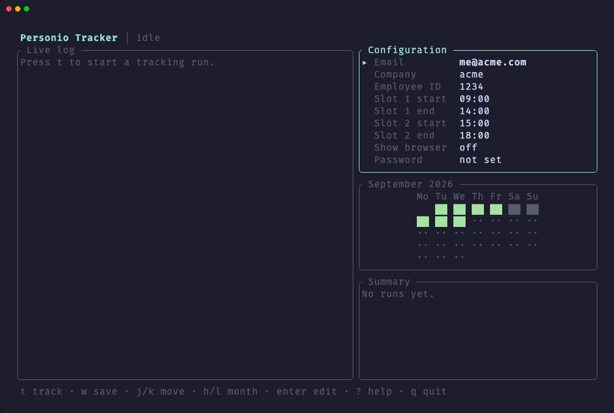
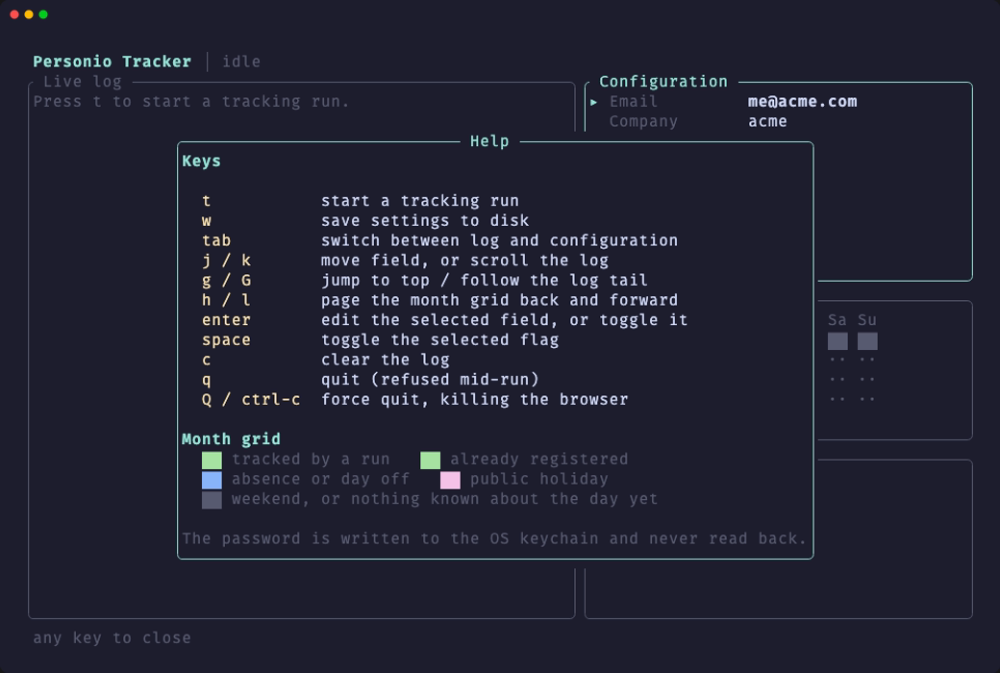

<p align="center">
  
</p>

A terminal UI that types your hours into the Personio days you have not
filled in yet.

> **Unofficial.** Not affiliated with, endorsed by, or supported by Personio SE.
> It drives their web UI exactly as you would, which is also why a redesign on
> their side can break it.

> **It types, you decide.** The hours it writes are the hours you configured, so
> the record is only true if you keep it true. A timesheet is meant to match the
> hours actually worked — in many countries that is a legal obligation, not a
> formality. The [month grid](docs/month-grid.md) is there for exactly that: read
> it, and fix any day it got wrong.

<p align="center">
  
</p>

## Quick install

```sh
git clone https://github.com/araluce/personio-tracker
cd personio-tracker
make install PREFIX="$HOME/.local"     # or: cargo install --path .
```

`make` on its own lists the other targets, `sudo make install` puts it in
`/usr/local/bin`, and [Install](docs/install.md) covers `DESTDIR` packaging and
how to uninstall. If the command is not found afterwards, `$HOME/.local/bin` is
not on your `PATH`.

### What you need

| | |
| --- | --- |
| **Rust** | a current stable toolchain — the crate is edition 2024, and is developed and tested on 1.98. Needed to build only; the binary is self-contained |
| **A Chromium browser** | Chrome, Chromium or Edge. Not bundled: it is found at runtime, and `--paths` prints which one won |
| **Nothing else** | no OpenSSL, no `pkg-config`, no `-dev` packages. The dependency tree is pure Rust plus each platform's own APIs, which is why CI builds it on a bare Ubuntu runner with no install step |

### Where it runs

| System | State | Detail |
| --- | --- | --- |
| **macOS** | verified | developed here; the password goes in the login keychain |
| **Linux** | verified by CI | all 140 tests pass on `ubuntu-latest`. The password goes to the Secret Service over D-Bus (gnome-keyring, KWallet), or to `PERSONIO_PASSWORD` where none is running |
| **Windows** | untested | the browser paths and the Credential Manager backend are in the tree and it should build, but nobody has run it. Reports welcome |

## First run

```sh
personio-tracker
```

1. Fill in **Email**, **Company** and **Employee ID** — `enter` edits the
   selected field. The last one is [not obvious](docs/configuration.md#employee-id);
   the app says where to find it under the field.
2. Press `w` to save, then `t` to run.
3. The first run opens a browser and logs in. Later runs replay that session,
   so they neither log in nor ask the OS for your password.

The grid under the configuration is the month at a glance, and it is drawn from
a local record: opening the app shows where the month stands before anything
runs.

`?` lists every key, and what each colour in the grid means:

<p align="center">
  
</p>

## Run it daily

The point of the thing: stop retyping the same two slots twenty times a month.

```sh
which personio-tracker    # the path depends on how you installed it
crontab -e                # opens $EDITOR; add the line below, save, done
```

```cron
0 9 * * * /usr/local/bin/personio-tracker --cli --headless >> "$HOME/Library/Logs/personio-tracker.log" 2>&1
```

Nothing to reload afterwards — `crontab -l` confirms it took. Saving writes the
whole crontab, so leave any `SHELL=` and `PATH=` lines already in there alone.

`--cli` because a scheduler has no terminal, the absolute path because it has no
useful PATH, and `--headless` because nobody is there to watch a browser open.
Scheduled runs keep the month grid current too, so opening the app shows what
was written without you ever pressing `t` — which is also how you review the
month.

Try it before waiting for 09:00, since a failing cron job fails quietly:

```sh
/usr/local/bin/personio-tracker --cli --headless; echo "exit=$?"
```

**On macOS, prefer a LaunchAgent.** A `cron` job runs outside the logged-in
session, where the keychain is out of reach — which only bites when the saved
session expires, but then it needs you. A LaunchAgent runs inside the session
and logs in by itself.

[Scheduling](docs/scheduling.md) has the plist to copy, the systemd option for
Linux, and what to do when a run reports `Login required`.

## Documentation

| To… | Read |
| --- | --- |
| install it, or find where its files live | [Install](docs/install.md) |
| set up email, company, employee id, work slots | [Configuration](docs/configuration.md) |
| understand the password and session handling | [Authentication](docs/authentication.md) |
| read the month grid and its colours | [Month grid](docs/month-grid.md) |
| know exactly what a run does to a timesheet | [Tracking](docs/tracking.md) |
| schedule it: cron, launchd, systemd | [Scheduling](docs/scheduling.md) |
| drive the UI: keys, panes, the log | [Interface](docs/interface.md) |
| work on the code | [Development](docs/development.md) |

## What it does

Walks the Personio timesheet from the current month backwards, registering the
configured two work slots on every trackable day that has no entry yet. It
stops at today's row (after filling it) and keeps stepping back a month while
that month still has fewer confirmed hours than its target.

Weekends, public holidays and absences are skipped, with the reason Personio
itself shows recorded in the log. [Tracking](docs/tracking.md) has the whole
walk, step by step.

## The one thing to know

**The selectors are Personio's, not ours.** This drives their real web UI, so a
redesign on their side breaks it. Everything that can break that way is listed
in [Tracking → When it breaks](docs/tracking.md#when-it-breaks), and every
selector lives in one file: `src/tracking/selectors.rs`.
